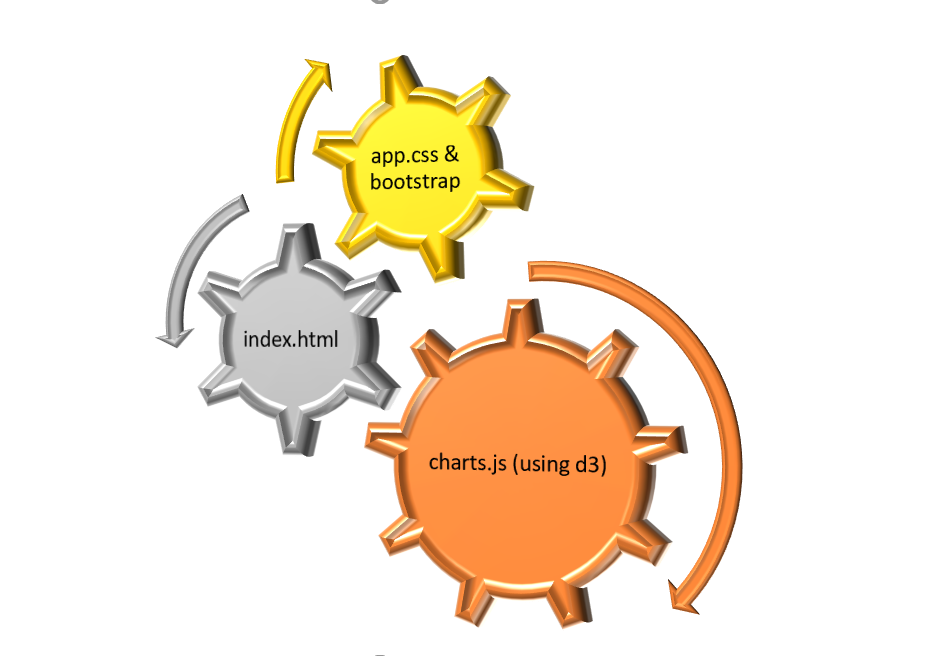
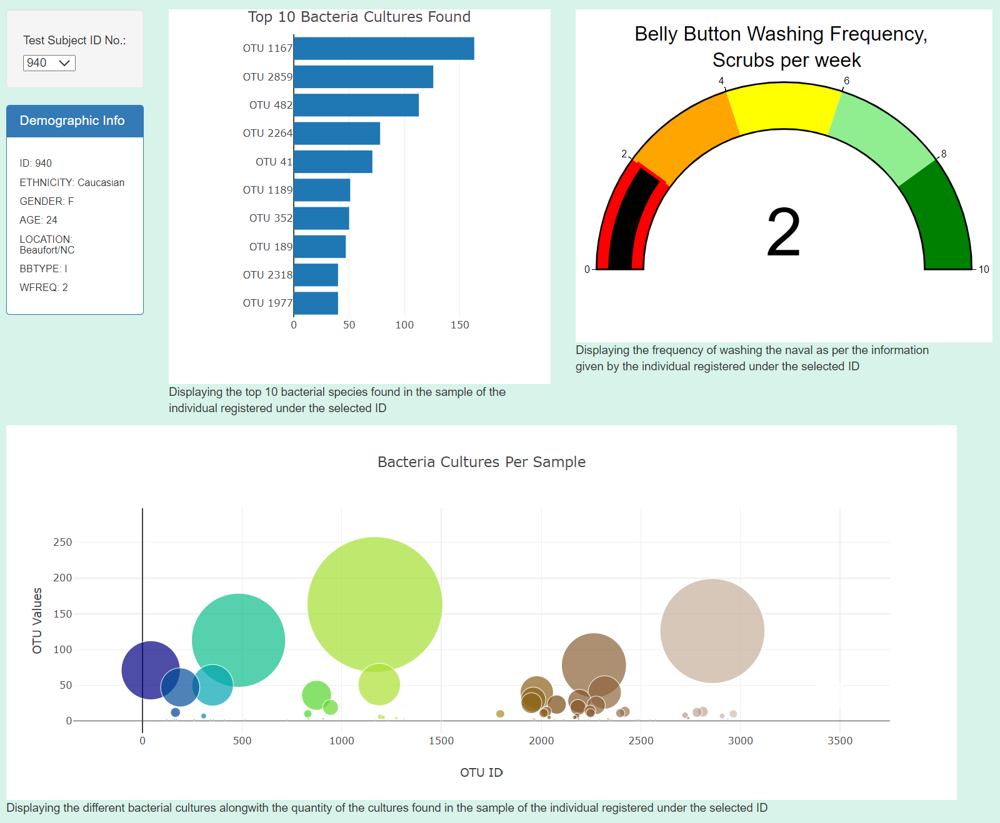

# Belly Button Biodiversity
Research on the bacterial species found in the belly button of humans that have the ability to synthesize proteins that taste like beef.

## Purpose of the Belly Button Diversity :
This analysis is done for a biological researcher of microbiology laboratory, who is working on studying about bacterial species that have the ability to synthesize proteins that taste like beef. The project is partnered with Improbable Beef to successfully synthesizing proteins to taste like beef. Certain bacteria found in the human belly button are best suited for synthesizing proteins into beef.
As the bacterial species found in every individual human body is different and hence samples are collected from people across the country and assigned an ID number for each sample. In order for the individuals who participated in the study to be able to access the data through a dashboard an interactive webpage is built.

## Basic Project plan and Tools used : 
Using JavaScript and D3 library, the data will be retrieved from a JSON file and data of each individual will be displayed on a webpage via a HTML file. Bootstrap and CSS styling will be used for styling the webpage.

## Results :
The results are filtered on the ID(default ID being the first ID in the data file) selected on the webpage. An event listener is used for the JavaScript file to call the functions to display the below results.

### 1. Demographic Info : 
A dropdown menu will list the ID numbers of all the volunteers. When a volunteer ID is chosen from the dropdown menu, that person's demographics information, such as location, sex, and age, will be displayed. 

### 2. Top 10 Bacteria Cultures found :
Once the ID is selected, it also displays a bar chart for the top 10 bacterial species (OTUs) found in the navel of that individual as per the samples results recorded in the data file. The bar chart is displayed in descending order of value, showing the highest concentration of a particular bacteria at the top.

### 3. Bacteria Cultures Per Sample
A bubble chart is used to display the volume of bacterial cultures found in the navel sample of that registered ID. The color of the bubbles is different for each bacteria type using the Earth theme here. The values of the OTU_IDs(Operational Taxonomic Unit) define the size of the bubble, thereby concluding that bigger the bubble is higher volume of that bacteria. Also when the cursor is hovered over the bubble it displays the value.

### 4. Belly Button Washing Frequency :
Washing Frequency of the navel is really important for the selection of the sample donor of the bacteria. Hence, we are using a gauge meter to display the washing frequency scrubs per week on a gauge from 0 to 10. The information is retrieved from the JSON data file and displayed in the gauge meter.

## Conclusion/ Summary :
The webpage makes it easier to glance at all the required results of a single sample. It a great tool to check a single individual ID with all the details like the demographic panel, top 10 bacteria cultures found, all bacteria cultures per sample and the wash frequency of the navel.

## Future projects :
Create a separate interactive webpage for the biologist to retrieve the following data from the data json file and be able to find the samples that suit the best for this project :

1.	Create a dropdown menu of the names of bacteria(OTU_IDs) in order to retrieve a list of top ten participants whose sample have that bacteria in high volume, listing the demographics of the participants.

2.	Add additional filters of minimum washing frequency scrubs per week that is essential to be a suitable candidate for the bacteria for synthesizing proteins into beef. 
